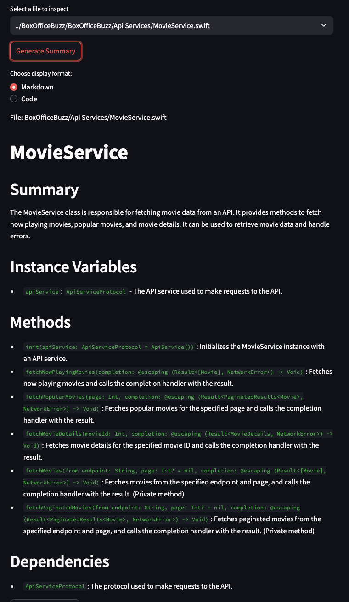
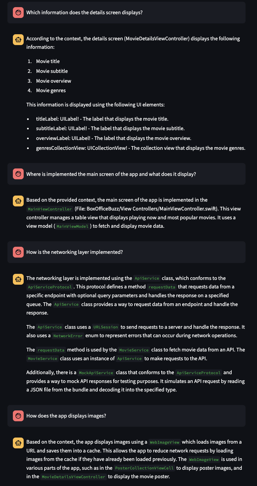
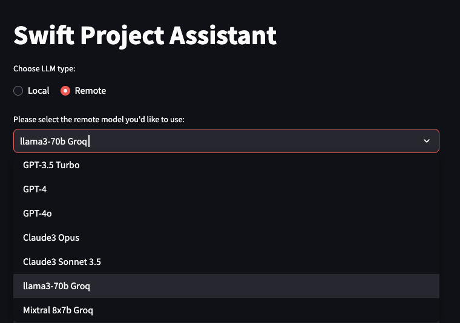
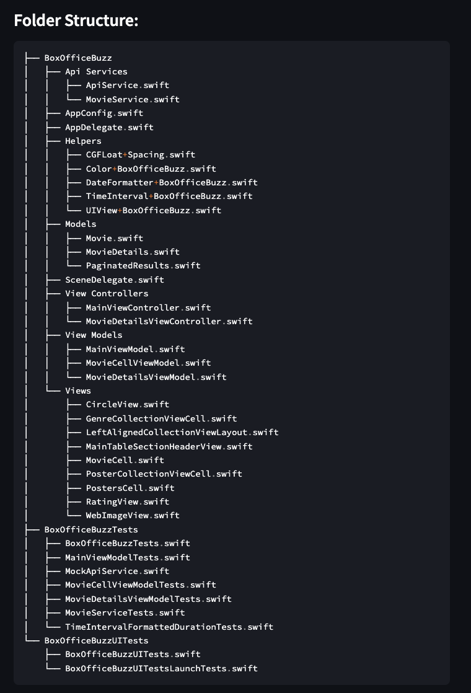

# Swift Project Assistant

Swift Project Assistant is a tool designed to help developers analyze, summarize, and interact with Swift projects. It leverages advanced language models and RAG (Retrieval-Augmented Generation) techniques to provide insightful summaries of Swift code files and answer questions about the project.

## Features

- **File Analysis**: Automatically analyzes Swift files in a specified project directory.
- **Code Summarization**: Generates comprehensive summaries of Swift code files, including classes, structs, methods, and dependencies.[^1]
  
- **Interactive Q&A**: Uses a RAG system to answer questions about the project based on generated documentation.
  
- **Flexible LLM Integration**: Supports multiple language models, including local and remote options.
  
- **Folder Exclusion**: Option to exclude specific folders from analysis.
- **Project Structure Visualization**: Displays the folder structure of the analyzed project.
  

[^1]: Screenshots generated using the [BoxOfficeBuzz](https://github.com/brunoguedes/BoxOfficeBuzz) project.

## Installation

1. Ensure you have Python 3.12 installed.
2. Clone this repository.
3. Install the required dependencies:

```
poetry install
```

## Usage

1. Set up your environment variables in a `.env` file.
2. Run the Streamlit app:

```
streamlit run src/app.py
```

3. In the web interface:
   - Select the LLM model you want to use.
   - Enter the file types you want to analyze.
   - Specify folders to exclude (if any).
   - Enter the base path of your Swift project.
   - Use the interface to generate summaries and interact with the Q&A system.

## Requirements

- Python 3.12
- Poetry for dependency management
- Various Python libraries (see `pyproject.toml` for full list)

## Project Structure

- `app.py`: Main Streamlit application
- `llm_runner.py`: Handles LLM interactions for code summarization
- `swift_dependency_analysis.py`: Analyzes Swift files for dependencies and structure

## Contributing

Contributions are welcome! Please feel free to submit a Pull Request.

## License

This project is licensed under the [MIT License](LICENSE).
