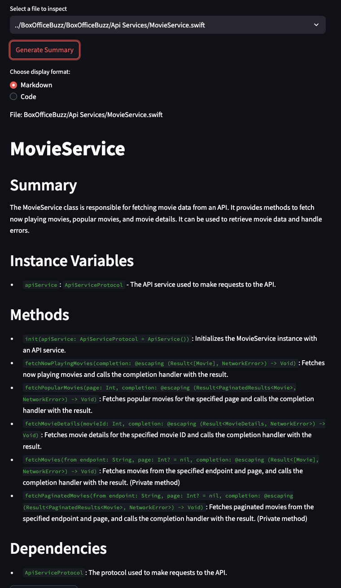
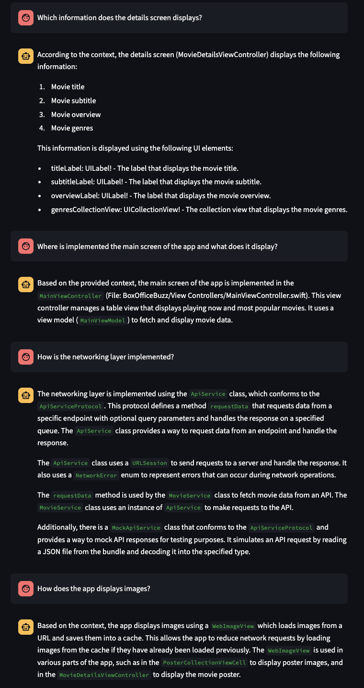
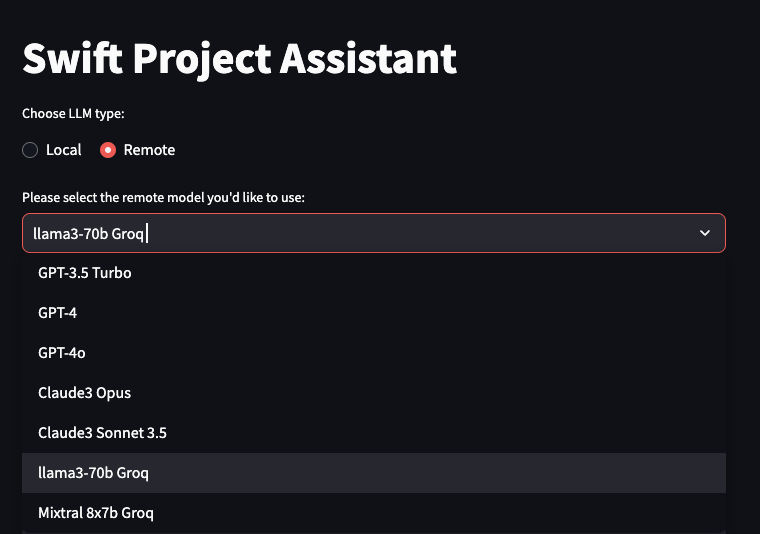
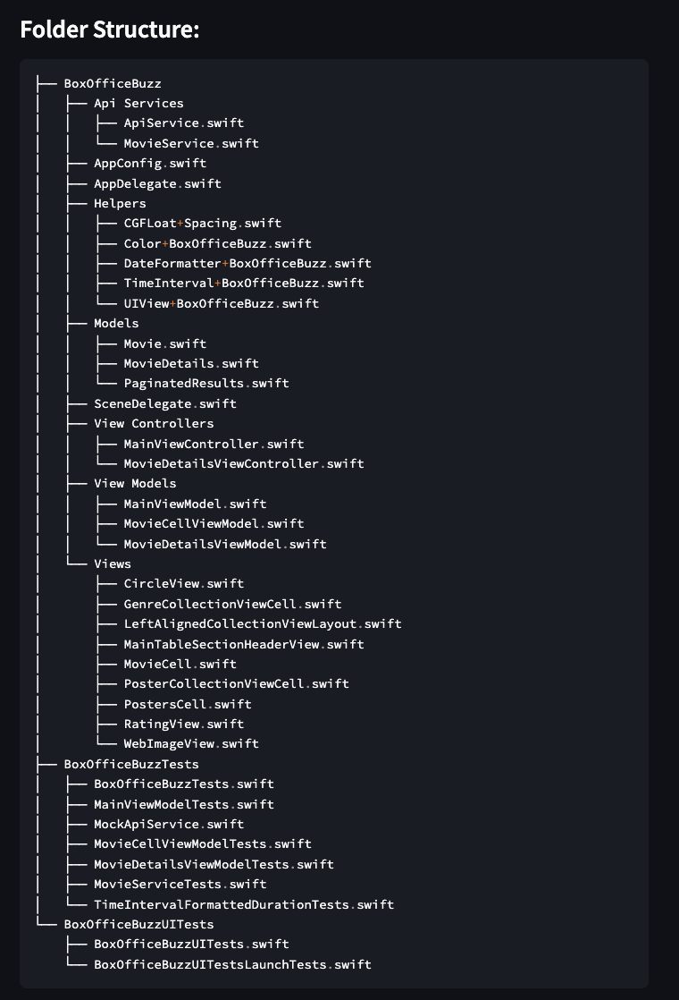

# Swift Project Assistant

Swift Project Assistant is a tool designed to help developers analyze, summarize, and interact with Swift projects. It ships two things:

1. **An MCP server** that gives AI agents (Claude Code, Claude Desktop, or any MCP client) structural understanding of a Swift codebase — outlines, symbol search, targeted source extraction — so they can answer questions and make changes **without reading whole files**, saving a large amount of tokens.
2. **A Streamlit app** that generates documentation for Swift files with the LLM of your choice and answers questions about the project using RAG (Retrieval-Augmented Generation).

## MCP Server

The MCP server is powered by [SourceKitten](https://github.com/jpsim/SourceKitten) — the Swift compiler's own tooling — so outlines, type names, and method signatures (including parameter labels like `fetchMovies(for:)`) are compiler-accurate. It's designed to run on your development machine:

```bash
brew install sourcekitten
```

### Tools

| Tool | What it does |
|---|---|
| `list_swift_files` | Project layout: every Swift file with line counts |
| `get_project_map` | Every type declared in the project (kind, name, conformances), per file |
| `get_file_outline` | One file's structure: imports, types, property/method signatures, enum cases — no bodies (~10x fewer tokens than the source) |
| `find_symbol` | Locate where a type, method, property, or function is declared |
| `get_symbol_source` | Extract the source of a single type or method (e.g. `MovieViewModel.fetchMovies`) instead of the whole file |
| `get_file_summary` | Markdown summary of a file, **cached inside the file itself** as a comment block with a generation timestamp — returned instantly (no SourceKitten run) while the file is unmodified |
| `get_file_dependencies` | A file's imports, declared types, and external conformances |

### In-file summary cache

`get_file_summary` writes its result to the top of the Swift file:

```swift
/* swift-project-assistant:summary
Generated: 2026-06-12T22:29:27.358654+00:00

# MovieViewModel.swift

**Imports:** Foundation, SwiftUI

## class MovieViewModel: ObservableObject

- `func fetchMovies(for category: Category) -> [Movie]`
*/
import Foundation
...
```

If the `Generated` timestamp is equal to or later than the file's modification time, the cached summary is returned without re-running SourceKitten (the file's mtime is pinned to the generation time, so writing the cache doesn't invalidate it). Editing the file makes the cache stale, and the next call regenerates and rewrites the block. Pass `refresh=true` to force regeneration.

### Install & run

```bash
poetry install
```

Add it to **Claude Code**:

```bash
claude mcp add swift-project-assistant -- poetry run --directory /path/to/swift_project_assistant swift-project-mcp
```

Or to **Claude Desktop** (`claude_desktop_config.json`):

```json
{
  "mcpServers": {
    "swift-project-assistant": {
      "command": "poetry",
      "args": ["run", "--directory", "/path/to/swift_project_assistant", "swift-project-mcp"]
    }
  }
}
```

Then ask your agent things like *"What view models are in ~/Projects/BoxOfficeBuzz and what do they depend on?"* — it will use the project map and outlines instead of reading every file.

## Streamlit App

- **File Analysis**: Automatically analyzes Swift files in a specified project directory (uses [SourceKitten](https://github.com/jpsim/SourceKitten) — macOS).
- **Code Summarization**: Generates comprehensive summaries of Swift code files, including classes, structs, methods, and dependencies.[^1]
  
- **Interactive Q&A**: Uses a RAG system to answer questions about the project based on generated documentation.
  
- **Flexible LLM Integration**: Supports current local and remote models — Claude Opus 4.8 / Sonnet 4.6 / Haiku 4.5, GPT-5 / GPT-4.1, Groq Llama 3.3, and local models via Ollama (Llama 3.3, Qwen 2.5 Coder, Codestral, Mistral).
  
- **Folder Exclusion**: Option to exclude specific folders from analysis.
- **Project Structure Visualization**: Displays the folder structure of the analyzed project.
  

[^1]: Screenshots generated using the [BoxOfficeBuzz](https://github.com/brunoguedes/BoxOfficeBuzz) project.

### Usage

1. Copy `.env_example` to `.env` and fill in the API keys you plan to use.
2. Run the Streamlit app:

```bash
poetry run streamlit run src/app.py
```

3. In the web interface:
   - Select the LLM model you want to use.
   - Enter the file types you want to analyze.
   - Specify folders to exclude (if any).
   - Enter the base path of your Swift project.
   - Use the interface to generate summaries and interact with the Q&A system.

## Requirements

- Python 3.11+
- [Poetry](https://python-poetry.org) for dependency management
- [SourceKitten](https://github.com/jpsim/SourceKitten) (`brew install sourcekitten`) — used by both the MCP server and the Streamlit app's file analysis
- Optional: local HuggingFace embeddings via `poetry install --extras huggingface`

## Project Structure

- `src/swift_project_assistant/` — installable package
  - `analyzer.py` — SourceKitten-backed structure analysis
  - `mcp_server.py` — the MCP server (`swift-project-mcp` entry point)
- `src/app.py` — Streamlit application
- `src/llm_runner.py` — LLM interactions for code summarization
- `src/swift_dependency_analysis.py` — SourceKitten-based analysis used by the Streamlit app
- `tests/` — parser test suite (`poetry run pytest`)

## Contributing

Contributions are welcome! Please feel free to submit a Pull Request.

## License

This project is licensed under the [MIT License](LICENSE).
